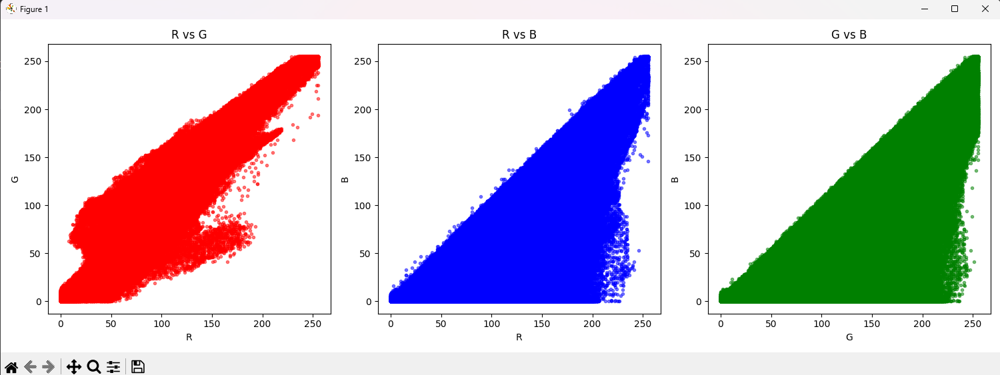
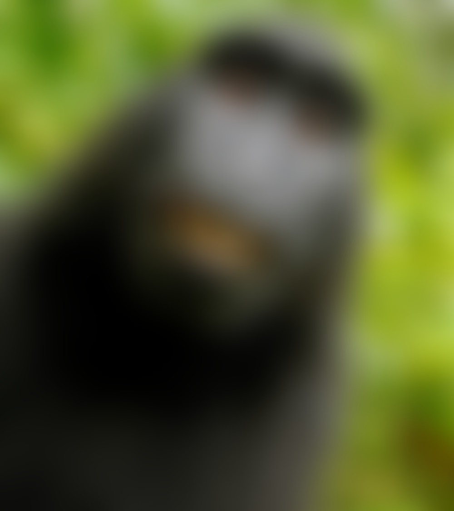
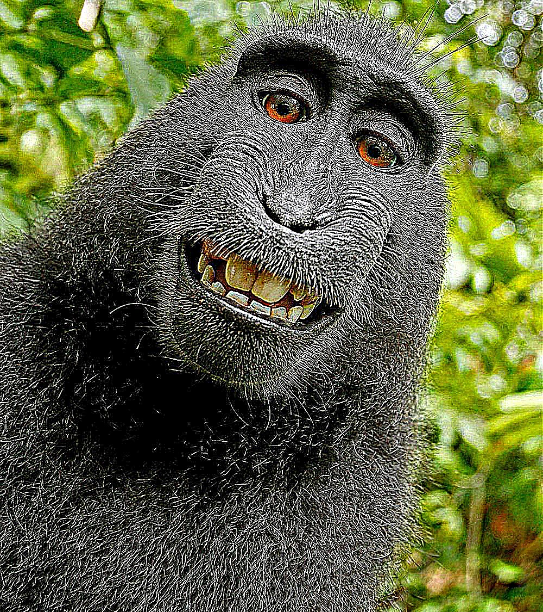
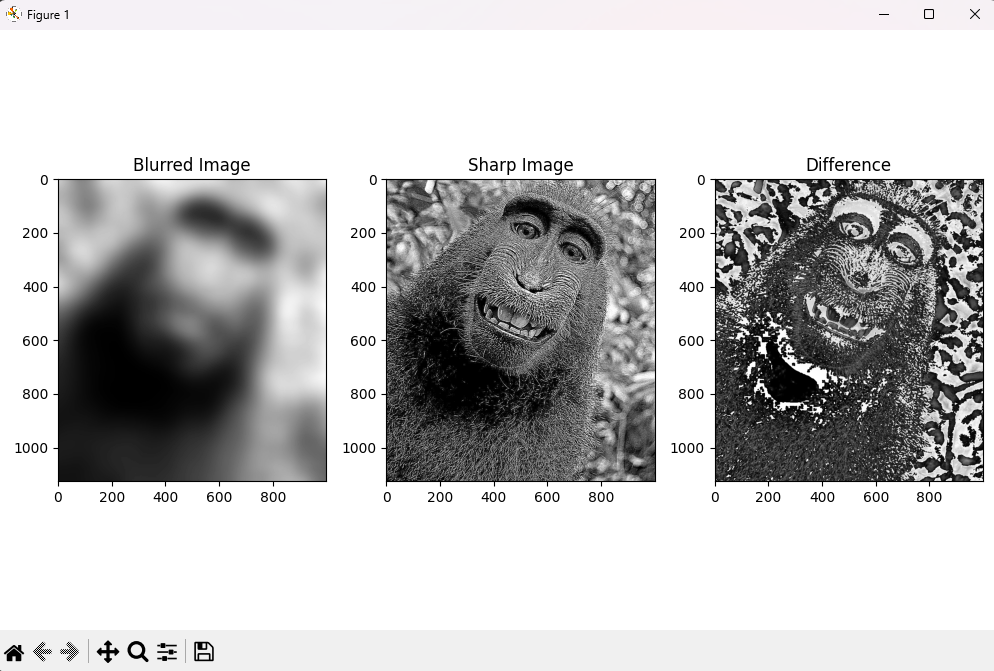

# Roll No: 1903095 

CSE 4106 - 2024/05/05 (Lab 2)

## Problem 1

Separate the R,G,B component from an RGB image? Suppose the image variable is im(255 by 255 by 3) then show the spectral correlation between the bands.


### Used Picture in Problem 1


## Output For Problem 1




## Code for Problem 1

```python
import cv2
import numpy as np
import matplotlib.pyplot as plt

# Load the image
image = cv2.imread('assets/pic2.jpg')
# image = cv2.imread('assets/pic3.png')

# Check if the image has been loaded successfully
if image is None:
    print("Error: Unable to load image.")
else:
    B, G, R = cv2.split(image)

    # Calculate the correlation coefficients
    correlation_RG = np.corrcoef(R.flatten(), G.flatten())[0, 1]
    correlation_RB = np.corrcoef(R.flatten(), B.flatten())[0, 1]
    correlation_GB = np.corrcoef(G.flatten(), B.flatten())[0, 1]

    # Display the correlation coefficients
    print("Correlation between R and G:", correlation_RG)
    print("Correlation between R and B:", correlation_RB)
    print("Correlation between G and B:", correlation_GB)

    # Plot the spectral correlation
    fig, axs = plt.subplots(1, 3, figsize=(15, 5))
    axs[0].scatter(R.flatten(), G.flatten(), color='red', marker='.', alpha=0.5)
    axs[0].set_title('R vs G')
    axs[0].set_xlabel('R')
    axs[0].set_ylabel('G')
    axs[1].scatter(R.flatten(), B.flatten(), color='blue', marker='.', alpha=0.5)
    axs[1].set_title('R vs B')
    axs[1].set_xlabel('R')
    axs[1].set_ylabel('B')
    axs[2].scatter(G.flatten(), B.flatten(), color='green', marker='.', alpha=0.5)
    axs[2].set_title('G vs B')
    axs[2].set_xlabel('G')
    axs[2].set_ylabel('B')
    plt.tight_layout()
    plt.show()
```

## Discussion for Problem 1

Our goal in this lab exercise was to extract the RGB (red, green, and blue) components from an image. The cv2.split() function was utilized to split the image into its individual color channels. In order to investigate the spectral correlation between each pair of color channels (R-G, R-B, and G-B), we next computed the correlation coefficients between them. We may better comprehend the links between the image's various color channels thanks to this study. In order to see any possible patterns or links in the image data, we lastly made scatter plots for each pair of color channels to visualize the spectral correlation.

-------------------------------------------------------------------

## Problem 2

Find 2 images from the Internet where one is blurred and the other one is sharp. Average out the both images with spatial filtering and display the difference.


### Problem 2

Blur Picture



Sharp Picture




## Output For Problem 2



## Code for Problem 2

```python
from PIL import Image, ImageFilter
import matplotlib.pyplot as plt
import numpy as np

# Load the images
blur_img = Image.open("assets/blur.jpg")
sharp_img = Image.open("assets/sharp.jpg")

# Convert images to grayscale
blur_gray = blur_img.convert("L")
sharp_gray = sharp_img.convert("L")

# Apply average spatial filtering to both images
blur_avg = blur_gray.filter(ImageFilter.BoxBlur(5))  # Adjust the radius as needed
sharp_avg = sharp_gray.filter(ImageFilter.BoxBlur(5))

# Convert images to numpy arrays
blur_arr = np.array(blur_avg)
sharp_arr = np.array(sharp_avg)

# Compute the difference between the filtered images
diff = np.abs(sharp_arr - blur_arr)

# Display the images and the difference
plt.figure(figsize=(10, 4))

plt.subplot(1, 3, 1)
plt.title('Blurred Image')
plt.imshow(blur_arr, cmap='gray')
plt.axis('off')

plt.subplot(1, 3, 2)
plt.title('Sharp Image')
plt.imshow(sharp_arr, cmap='gray')
plt.axis('off')

plt.subplot(1, 3, 3)
plt.title('Difference')
plt.imshow(diff, cmap='gray')
plt.axis('off')

plt.show()
```

## Discussion for Problem 2

In this lab task, we aimed to compare the effects of spatial filtering on two images: one blurred and one sharp. We loaded the images, converted them to grayscale for processing ease, and then applied average spatial filtering using a box blur filter to both images. By subtracting the filtered versions of the images from each other, we computed the difference, which highlights areas of discrepancy between the two. This allows us to visually discern the impact of blurring on image sharpness and to evaluate the efficacy of spatial filtering in image enhancement.
